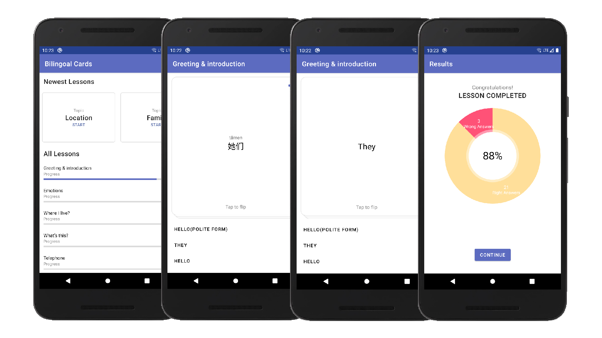

# Bilingoal Cards

> Bilingoal Cards is a language-learning Android app that has been created as my final CS50x project. It designed to help its users to study Chinese using flashcards.

## Table of contents

- [Screenshots](#screenshots)
- [Technologies](#technologies)
- [Features](#features)
- [Contact](#contact)

## Screenshots

## Technologies

- Room Database
- MPAndroidChart
- Navigation Component

## Features

- Learn with flashcards
- Listen to words, phrases and questions pronounced correctly by a native speaker.
- Learn Chinese
- Track your progress
- Pinyin
- Flip cards to see English translation

To-do list:

- switch to Kotlin
- implement local unit & instrumented tests

## Contact

Created by [@merklol](https://www.facebook.com/merk.merklol) - feel free to contact me!
